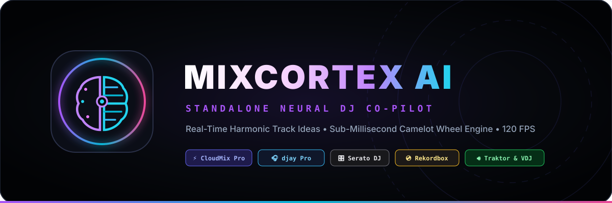

# ⚡ CloudMix Pro & MixCortex AI

  

> **Next-Gen Cloud-Native Professional DJ Workstation with MixCortex AI Neural Co-Pilot, Real-Time Stem Separation, and Universal Integration for Algoriddim djay Pro, Serato, Rekordbox, Traktor, and VirtualDJ.**

---

## 🧠 Introducing MixCortex AI — Neural DJ Co-Pilot

**MixCortex AI** is an ultra-fast, intelligent harmonic mixing companion. Available both embedded directly inside **CloudMix Pro** and as a **Standalone Independent Desktop Application** hosted in its own dedicated repository at **[iammrwrath/MixCortex-AI](https://github.com/iammrwrath/MixCortex-AI)**. MixCortex listens to what you're playing and serves the next best tracks in **sub-millisecond speed (0.93ms)**.

### MixCortex AI Highlights
- ⚡ **0.936ms Harmonic Retrieval**: Instantaneous 24-key Camelot wheel harmonic & tempo matching across thousands of tracks with zero latency.
- 🎛️ **Studio Web Audio Audition Player**: Instant headphone pre-listening with 80ms anti-pop crossfading and 64-bin FFT canvas oscilloscope visualizer.
- 🎯 **Interactive Camelot Wheel Radar**: 24-sector visual radar displaying harmonic proximity, energy transitions, and key compatibility.
- 🧬 **"My Style" Machine Learning Taste Adaptation**: Learns your signature mixing transitions, preferred energy arcs, and custom pairing patterns over time.
- 🪟 **Floating See-Through HUD Overlay**: Frameless desktop window with adjustable transparency (40%–100%) and always-on-top pin toggle—designed to hover non-intrusively over any DJ software during live performances.
- 🔄 **In-App GitHub Patch Downloader**: Checks GitHub Releases in real-time, displays visual patch notes with progress tracking, and applies updates in 1 click.

---

## 🌐 Universal DJ Software Compatibility Matrix

MixCortex AI seamlessly bridges with all leading DJ software suites without requiring complex plugins:

| DJ Software | Integration Method | Capabilities |
| :--- | :--- | :--- |
| **CloudMix Pro** | Direct Two-Way IPC / BroadcastChannel | Instant 1-click remote deck load, bi-directional sync, zero latency |
| **Algoriddim djay Pro** | SQLite `MediaLibrary.db` + Streamer Hook | Real-time deck detection, metadata synchronization |
| **Serato DJ Pro** | Session History + `nowplaying.txt` | Auto-detect active track, BPM, key, and deck assignment |
| **Pioneer Rekordbox** | Text Stream / Pro DJ Link watcher | Continuous harmonic recommendations based on live master deck |
| **Native Instruments Traktor** | Broadcast stream metadata reader | Automated crate matching and key energy curve analysis |
| **VirtualDJ** | NetSearch / History Log Bridge | Dynamic track suggestion feed during live mix |
| **Manual / Universal** | Audio Drag & Drop / Pin Reference Track | Explore harmonic transitions for any song on the fly |

---

## 🌟 CloudMix Pro Workstation Features

- 🎧 **Motorized Holographic Jog Wheels**: Authentic vinyl platter spinning at 33.3 RPM with anisotropic radial sheen, 360° circular progress needle arc, and center LCD HUD with live warning pulses.
- 🧬 **Neural Mix Real-Time Stems**: Isolate **Vocals**, **Bass**, **Harmonies**, and **Drums** on the fly with live multi-band frequency filtering and Neural FX transition algorithms (Bass Swap, Vocal Swap, Harmonic Crossfade).
- ☁️ **Cloud-Native Music Sync**: Direct streaming and sync support for **Google Drive** libraries and **AuraMusic / YouTube Music** integration without redownloading local copies.
- 📊 **High-Definition Tri-Band Waveforms**: Multi-layer frequency separation (Sub/Bass, Mid/Vocals, Treble/Hi-Hats) with mirrored baseline reflection, downbeat beatgrid flags, and illuminated Hot Cue pins.
- 🎛️ **Studio-Grade Rotary Dials**: Perimeter circular SVG LED arc with dual unipolar and bipolar modes, tactile 0 dB center detent snapping, and double-click instant reset.
- 🟩 **Tactile 3D RGB Performance Pads**: Authentic Pioneer DDJ and Akai MPC style silicone pads with Hot Cues (1–8), Auto Loop, Beat Jump, and Stem Mute/Solo modes.
- 📡 **StreamerBot & Broadcast Integration**: Automatically broadcasts real-time `nowplaying.txt` and beat triggers for OBS overlays and stream automation.

---

## 🚀 Installation & Downloads

Head over to the **[Latest GitHub Releases](https://github.com/iammrwrath/CloudMix-Pro/releases/latest)** to download:

### 1. CloudMix Pro (Complete DJ Workstation + Embedded MixCortex)
- **`CloudMix-Pro-Setup.exe`**: Full Windows installer with desktop and start menu shortcuts.
- **`CloudMix-Pro-Portable.exe`**: Zero-install standalone executable.

### 2. MixCortex AI (Standalone Neural DJ Co-Pilot)
- **`MixCortex-AI-Setup.exe`**: Dedicated standalone installer for MixCortex AI companion app.
- **`MixCortex-AI-Portable.exe`**: Lightweight portable version to keep on a USB drive alongside your music crate.

---

## ⌨️ Global DJ Keyboard Controls

| Key | Target | Function |
| :---: | :---: | :--- |
| **`W`** | **Deck A** | Play / Pause |
| **`Q`** | **Deck A** | Cue / Return to Cue |
| **`E`** | **Deck A** | Beatgrid Sync |
| **`1` – `4`** | **Deck A** | Trigger Hot Cues 1–4 |
| **`I`** | **Deck B** | Play / Pause |
| **`U`** | **Deck B** | Cue / Return to Cue |
| **`O`** | **Deck B** | Beatgrid Sync |
| **`7` – `0`** | **Deck B** | Trigger Hot Cues 1–4 |
| **`Z`** | **Crossfader** | Snap to Deck A (-1.0) |
| **`X`** | **Crossfader** | Center Crossfader (0.0) |
| **`C`** | **Crossfader** | Snap to Deck B (+1.0) |
| **`L`** | **Library** | Toggle Full-Width Library Drawer |

---

## 🛠️ Tech Stack & Architecture

- **Runtime**: [Electron 44](https://www.electronjs.org/) + Node.js (with Context Isolation and custom audio IPC bridges)
- **Frontend**: [React 19](https://react.dev/), [TypeScript](https://www.typescriptlang.org/), [Tailwind CSS 4](https://tailwindcss.com/)
- **Bundler**: [Vite 8](https://vitejs.dev/)
- **Audio DSP**: Web Audio API with multi-node BiquadFilter networks, real-time AnalyserNodes, dynamic compressor lookaheads, and IndexedDB caching
- **Packaging & Updates**: [electron-builder](https://www.electron.build/) + [electron-updater](https://www.electron.build/auto-update)

---

## 📄 License

Distributed under the MIT License. Copyright © 2026 CloudMix Audio Labs / @iammrwrath.
