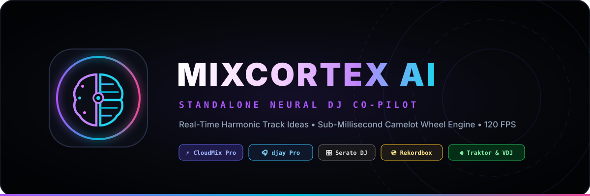

# 🎧 CloudMix Pro

<p align="center">
  
</p>

> **The Next-Gen All-in-One Cloud DJ Workstation & Content Creator Hub.**  
> Featuring real-time **Neural Stems on live streaming audio**, multi-screen resolution auto-scaling, cloud streaming (YouTube Music & Google Drive), studio multi-FX, pro 8-pad sampler, OBS HUD broadcast overlay, and AI-assisted harmonic mixing.

[](LICENSE)
[](https://github.com/iammrwrath/CloudMix-Pro/releases)
[](https://github.com/iammrwrath/CloudMix-Pro/releases/tag/v1.9.1)
[](https://electronjs.org)
[](https://react.dev)
[](https://vitejs.dev)

---

## 🌟 Why CloudMix Pro?

Traditional DJ applications like Serato, Traktor, VirtualDJ, and Algoriddim djay Pro either lock your music behind local offline hard drives, disable stem separation on streaming audio, or lack direct integration for live streamers and content creators.

**CloudMix Pro** combines the best capabilities of all industry-leading DJ suites into a single, high-performance workstation:

1. **Live Neural Stems on Streaming Audio**: Isolate **Vocals**, **Bass**, **Harmonies**, and **Drums** in real time directly from **YouTube Music** and cloud streams—no manual downloading or pre-rendering needed.
2. **Cloud-Native Music Library**: Seamlessly stream and blend tracks directly from **YouTube Music** (with persistent authentication) and **Google Drive** collections, alongside local drive audio.
3. **Multi-Screen & Dynamic DPI Auto-Scaling**: Automatically senses display resolution and monitor scaling changes when dragging across 1080p, 1440p, 4K, or high-DPI laptop displays so every control fits and renders sharply.
4. **Studio Multi-FX Suite**: High-density concert hall reverb with stereo diffusion, analog tape delay with resonant lowpass feedback, comb flanger, quantized bitcrusher, and resonant filters.
5. **Pro 8-Pad Sampler & Sound Banks**: Authentic club sound effects (Kingston Dancehall airhorns, dub sirens, 808 sub drops, turntable scratches, spinbacks, and hype vocal drops) with One-Shot, Gate Hold, Toggle, and Beatloop quantize modes.
6. **OBS & Live Broadcast Integration**: Built-in HTTP streaming server, transparent HUD overlay browser source (`/overlay`), and Streamer.bot webhooks for viewer song requests and channel-point sound triggers.
7. **Zero-Latency Settings & Instant Library Indexing**: Non-blocking background library caching and automatic genre detection (Dancehall, Afrobeats, Hip-Hop, House, Techno, R&B, Drum & Bass, Latin, Pop, Rock, etc.).
8. **Intelligent Harmonic Mixing Assistant**: Built-in harmonic co-pilot providing sub-millisecond Camelot wheel key matching, BPM radars, and dynamic AutoMix transitions.

---

## 🎛️ CloudMix Pro Core Capabilities

### 💽 Dual Decks & Motorized Vinyl Physics
- **Holographic Jog Wheels**: Authentic vinyl platter physics at 33.3 RPM with anisotropic radial sheen, scratch physics, needle seeking, and center LCD displaying elapsed/remaining time and warning pulses.
- **Tri-Band Real-Time Waveforms**: Multi-layer frequency visualization (Sub/Bass, Mid/Vocals, Treble/Hi-Hats) with mirrored baseline reflection, downbeat beatgrid flags, and illuminated Hot Cue pins.
- **Precision Rotary Dials**: 3D LED arc dials with dual unipolar and bipolar modes, tactile 0 dB center detent snapping, and double-click instant reset.

### 🧬 Real-Time Neural Stems
- **4-Stem Independent Control**: Vocals, Bass, Drums, and Harmonics with live level sliders, mute toggles, and solo audition.
- **Live Streaming Support**: Stem isolation works on live YouTube Music streams as well as local files.
- **One-Click Quick Isolations**: Instant Acapella, Instrumental, and Drums-only performance shortcuts.

### 🎚️ Pro Sampler (VirtualDJ & Mixxx Benchmark)
- **8-Pad Performance Matrix**: Velocity-sensitive trigger pads with visual waveform feedback.
- **Sound Banks**: Soundclash / Reggae, Hip-Hop / Trap, EDM / Club, and Custom user sound banks.
- **Trigger Modes**: One-Shot, Gate Hold, Toggle, and Beatloop with beatgrid quantize synchronization.

### 📺 Live Streaming & OBS Studio HUD
- **Transparent OBS Browser Source**: Connect OBS Studio to `http://localhost:3000/overlay` for a broadcast-ready HUD displaying album art, animated audio visualizer, elapsed progress bar, BPM, and key tags.
- **Streamer.bot Integration**: Native endpoints for viewer song requests and twitch/kick channel point soundboard activations.

### 🧠 Built-In Harmonic Co-Pilot
- **Sub-Millisecond Key Matching**: Instant 24-key Camelot wheel harmonic search across your entire library.
- **Interactive Camelot Radar**: Visualizes harmonic compatibility and energy jumps before mixing.
- **Dynamic AutoMix Transitions**: Phrase-synchronized 16/32-beat crossfading with automatic low-end bass EQ swapping.

---

## 🌐 Universal Library & Ecosystem Compatibility

CloudMix Pro integrates seamlessly with your existing DJ crates and collections:

| Source / Software | Integration Method | Capabilities |
| :--- | :--- | :--- |
| **YouTube Music** | Native Embedded Deck Bridge | Stream directly to Deck A/B, import Liked Music & playlists, live stems |
| **Google Drive** | Direct Cloud Indexing | Stream and index remote cloud music directories |
| **Algoriddim djay Pro** | Native SQLite `MediaLibrary.db` | Auto-detects local djay Pro cue points, playlists, and history |
| **Serato / Rekordbox / Traktor** | CSV / Crate / History Ingestion | Full metadata import: BPM, key, cue points, and ratings |
| **Local File System** | Zero-Latency Background Scanner | MP3, FLAC, WAV, AAC, M4A, OGG, and AIFF audio support |

---

## ⌨️ Global DJ Keyboard Controls

| Key | Deck / Target | Function |
| :---: | :---: | :--- |
| **`W`** | **Deck A** | Play / Pause |
| **`Q`** | **Deck A** | Cue / Return to Cue |
| **`E`** | **Deck A** | Beatgrid Sync |
| **`1` – `4`** | **Deck A** | Trigger Hot Cues 1–4 |
| **`I`** | **Deck B** | Play / Pause |
| **`U`** | **Deck B** | Cue / Return to Cue |
| **`O`** | **Deck B** | Beatgrid Sync |
| **`7` – `0`** | **Deck B** | Trigger Hot Cues 1–4 |
| **`Z`** | **Crossfader** | Snap Crossfader to Deck A (-1.0) |
| **`X`** | **Crossfader** | Center Crossfader (0.0) |
| **`C`** | **Crossfader** | Snap Crossfader to Deck B (+1.0) |
| **`L`** | **Library** | Toggle Full-Width Music Library Drawer |

---

## 🚀 Installation & Releases

Download the latest release from the **[GitHub Releases Page](https://github.com/iammrwrath/CloudMix-Pro/releases/latest)**:

- **`CloudMix-Pro-Setup.exe`**: Full Windows installer with auto-update support, desktop shortcut, and hardware acceleration presets.
- **`CloudMix-Pro-Portable.exe`**: Zero-install standalone executable for USB drives and mobile gig setups.

---

## 🛠️ Development & Building from Source

### Prerequisites
- [Node.js](https://nodejs.org/) (v20+ recommended)
- [npm](https://www.npmjs.com/)

### Clone and Install
```bash
git clone https://github.com/iammrwrath/CloudMix-Pro.git
cd CloudMix-Pro
npm install
```

### Run in Development Mode
```bash
npm run dev
```

### Build Production Binary
```bash
npm run build
npm run package:cortex
```

---

## 📄 License

Distributed under the MIT License. Copyright © 2026 CloudMix Audio Labs / @iammrwrath.
